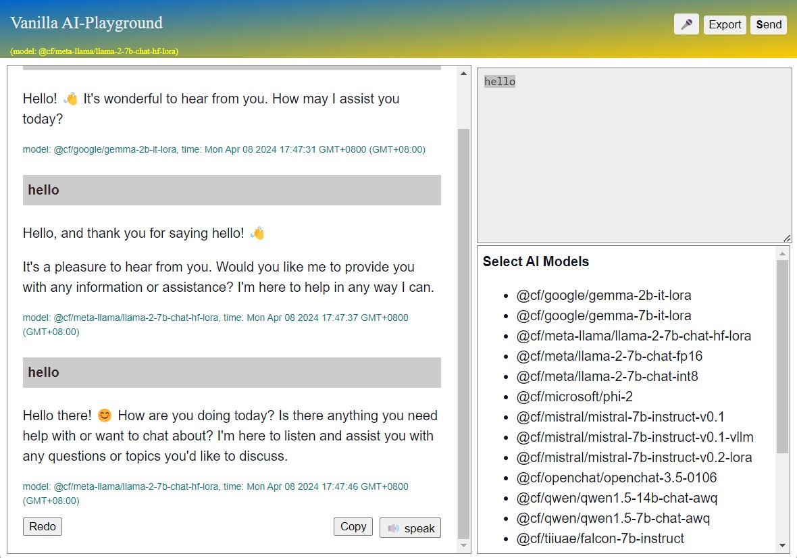

# vanilla-worker-playground

Vanilla worker playground for cloudflare AI, also act as cloudflare API proxy.

* [demo] https://playground.pingshan.uk/
* [worker] cf-worker-playground.js
* [html] cf-worker-playground.html 

## How to setup

1. create an worker in cloudflare
2. click [edit code] in cloudflare console panel
3. copy-and-paste the code in `cf-worker-playground.js`, then deploy
4. add 2 variables `CLOUDFLARE_AC_ID` and `CLOUDFLARE_API_KEY`

that's all.

## Features

1. a proxy for cloudflare AI API (for POST request)
2. a chatbot for all major models provided by cloudflare AI API (for GET request)
3. click to switch AI model any time
4. export or print conversation
5. voice recognition and speak
6. responsive for mobile

## Notes

* sorry for rush, the source code not well formatted.
* vanilla javascript, less than 300 line html/css/js, plus 50 lines js for worker.
* html version: `vanilla-worker-playground.html` may run anywhere calling worker as proxy.
* last udpated on 2024/04/08c
* MIT license
  
